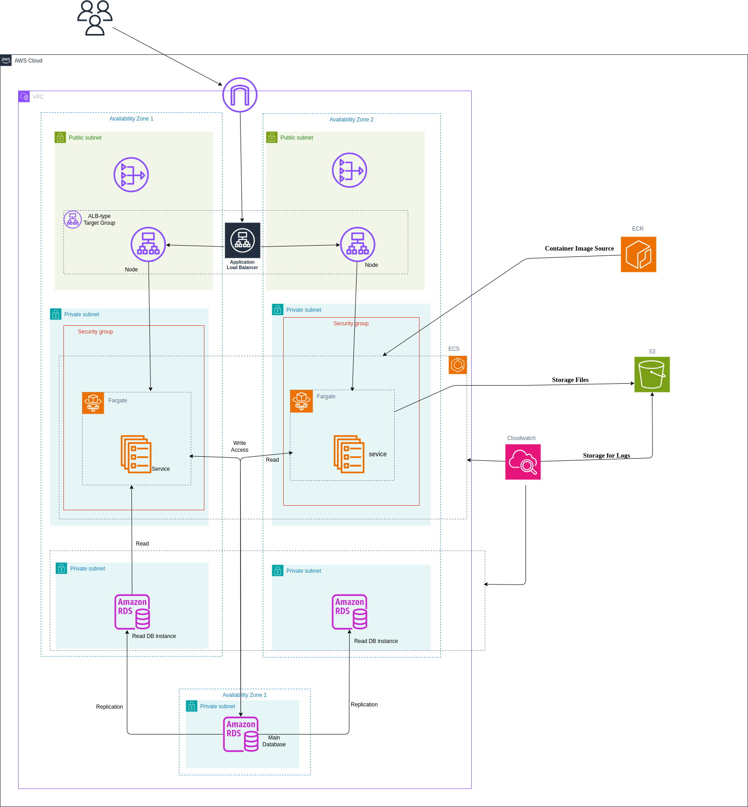

# AWS ECS Hospital Management System Infrastructure

This repository contains Terraform code to deploy a Hospital Management System on AWS using Elastic Container Service (ECS) with an Application Load Balancer (ALB).

## Table of Contents

- [Architecture Overview](#architecture-overview)
- [Prerequisites](#prerequisites)
- [Repository Structure](#repository-structure)
- [Module Details](#module-details)
- [Deployment Instructions](#deployment-instructions)
- [Configuration Variables](#configuration-variables)
- [Logging and Monitoring](#logging-and-monitoring)
- [Security Features](#security-features)
- [Troubleshooting](#troubleshooting)
- [Maintenance and Operations](#maintenance-and-operations)

## Architecture Overview

This infrastructure deploys a containerized Hospital Management System with the following components:



- **Networking**: Custom VPC with public and private subnets across multiple availability zones
- **Compute**: ECS Fargate for running containerized applications
- **Load Balancing**: Application Load Balancer for distributing traffic
- **Database**: RDS MySQL instance for application data
- **Storage**: S3 bucket for logs and application assets
- **Monitoring**: CloudWatch for logs and metrics
- **Container Registry**: ECR for storing application container images
- **Security**: IAM roles and security groups for proper access control

## Prerequisites

- AWS CLI installed and configured with appropriate credentials
- Terraform v1.0.0 or newer
- Docker installed locally (for building and pushing container images)
- Access to the Docker Hub `markhill97/hospital_app` repository

## Repository Structure

```
new-lab3/
├── main.tf                # Main Terraform configuration
├── variables.tf           # Input variables
├── outputs.tf             # Output values
├── dockerhub_to_ecr.tf    # Script to pull from Docker Hub and push to ECR
├── modules/
│   ├── alb/               # Application Load Balancer module
│   ├── cloudwatch/        # CloudWatch Logs module
│   ├── ecr/               # Elastic Container Registry module
│   ├── ecs/               # Elastic Container Service module
│   ├── iam/               # Identity and Access Management module
│   ├── rds/               # Relational Database Service module
│   ├── s3/                # Simple Storage Service module
│   └── vpc/               # Virtual Private Cloud module
└── README.md              # This file
```

## Module Details

### VPC Module

Creates a custom VPC with:
- Public and private subnets across multiple availability zones
- Internet Gateway for public subnets
- NAT Gateway for private subnets
- Route tables and security groups
- VPC endpoints for ECR, S3, and CloudWatch Logs

### ECS Module

Configures the container service with:
- ECS cluster
- Task definition for the hospital application
- ECS service running on Fargate
- Network configuration using private subnets
- Integration with the ALB target group

### ALB Module

Sets up the load balancer with:
- Application Load Balancer in public subnets
- Target group for the ECS service
- HTTP listener on port 80
- Health checks for the target group
- Access logs stored in S3

### RDS Module

Provisions the database with:
- MySQL RDS instance in private subnets
- Custom parameter group
- Database credentials management
- Subnet group for high availability

### S3 Module

Creates storage with:
- S3 bucket for logs and assets
- Server-side encryption
- Lifecycle rules for log rotation
- Bucket policies for service access

### CloudWatch Module

Configures monitoring with:
- Log group for ECS container logs
- Log retention policy

### IAM Module

Sets up access control with:
- ECS task execution role
- CloudWatch to S3 role
- Necessary policies and permissions

### ECR Module

Provides container registry with:
- ECR repository for the hospital application
- Repository policy

## Deployment Instructions

1. **Clone this repository**:
   ```bash
   git clone [(https://github.com/Mark-hil/Terraform_Repo/edit/main/lampstack-with-modules)]
   cd lampstack-with-modules
   ```

2. **Initialize Terraform**:
   ```bash
   terraform init
   ```

3. **Review and modify variables** in `variables.tf` as needed.

4. **Plan the deployment**:
   ```bash
   terraform plan
   ```

5. **Apply the configuration**:
   ```bash
   terraform apply
   ```

6. **Access the application** via the ALB DNS name provided in the outputs.

## Configuration Variables

The following variables can be customized to configure your infrastructure deployment:

<table>
  <tr>
    <th align="left">Variable</th>
    <th align="left">Description</th>
    <th align="left">Default</th>
  </tr>
  <tr>
    <td><code>aws_region</code></td>
    <td>AWS region to deploy resources</td>
    <td><code>eu-west-1</code></td>
  </tr>
  <tr>
    <td><code>vpc_cidr_block</code></td>
    <td>CIDR block for the VPC</td>
    <td><code>10.0.0.0/16</code></td>
  </tr>
  <tr>
    <td><code>public_subnet_cidrs</code></td>
    <td>CIDR blocks for public subnets</td>
    <td><code>["10.0.1.0/24", "10.0.2.0/24"]</code></td>
  </tr>
  <tr>
    <td><code>private_subnet_cidrs</code></td>
    <td>CIDR blocks for private subnets</td>
    <td><code>["10.0.3.0/24", "10.0.4.0/24"]</code></td>
  </tr>
  <tr>
    <td><code>ecr_repository_name</code></td>
    <td>Name for the ECR repository</td>
    <td><code>hospital_app</code></td>
  </tr>
  <tr>
    <td><code>alb_name</code></td>
    <td>Name for the Application Load Balancer</td>
    <td><code>ecs-alb</code></td>
  </tr>
  <tr>
    <td><code>ecs_cluster_name</code></td>
    <td>Name of the ECS cluster</td>
    <td><code>ecs-cluster</code></td>
  </tr>
  <tr>
    <td><code>db_username</code></td>
    <td>Username for the RDS database</td>
    <td><code>admin</code></td>
  </tr>
  <tr>
    <td><code>db_password</code></td>
    <td>Password for the RDS database</td>
    <td><code>password123</code></td>
  </tr>
  <tr>
    <td><code>db_name</code></td>
    <td>Name for the RDS database</td>
    <td><code>hospital_db</code></td>
  </tr>
  <tr>
    <td><code>s3_bucket_name</code></td>
    <td>Name for the S3 bucket</td>
    <td><code>my-storage-bucket</code></td>
  </tr>
  <tr>
    <td><code>log_group_name</code></td>
    <td>Name for the CloudWatch log group</td>
    <td><code>/ecs/hospital-app</code></td>
  </tr>
</table>

These variables can be overridden by creating a `terraform.tfvars` file or by passing them directly to the `terraform apply` command.

## Logging and Monitoring

### ALB Access Logs
- Stored in S3 bucket under `logs/alb/` prefix
- Includes client IP, request times, paths, response codes, and latency

### Container Logs
- Available in CloudWatch Logs under the `/ecs/hospital-app` log group
- Retention period: 14 days

### S3 Lifecycle Management
- Logs are moved to Infrequent Access storage after 30 days
- Logs are deleted after 90 days

## Security Features

- **Network Isolation**: ECS tasks and RDS instances in private subnets
- **Security Groups**: Least privilege access between services
- **Encryption**: S3 bucket with AES-256 encryption
- **IAM Roles**: Specific permissions for each service
- **VPC Endpoints**: Private communication with AWS services

## Troubleshooting

### 504 Gateway Timeout
- **Cause**: ALB cannot receive a response from ECS service within the timeout period
- **Solution**: 
  - Check ALB health check settings (timeout must be smaller than interval)
  - Verify ECS service is running and healthy
  - Check database connectivity
  - Inspect CloudWatch logs for application errors

### Container Pull Errors
- **Cause**: ECS tasks in private subnets cannot reach ECR
- **Solution**:
  - Verify VPC endpoints for ECR API and ECR DKR are configured
  - Check security groups allow traffic to VPC endpoints
  - Ensure the container image exists in ECR

### Database Connection Issues
- **Cause**: Application cannot connect to RDS
- **Solution**:
  - Verify security groups allow traffic from ECS to RDS
  - Check environment variables in ECS task definition (DB_SERVER, DB_USER, DB_PASS, DB_NAME)
  - Ensure RDS instance is running and accessible

## Maintenance and Operations

### Updating the Application
1. Build a new version of the container image
2. Push it to Docker Hub
3. Update the tag in `dockerhub_to_ecr.tf`
4. Run `terraform apply` to pull and push to ECR

### Scaling the Service
- Modify the `desired_count` parameter in the ECS service configuration
- Consider setting up auto-scaling based on CPU/memory utilization

### Database Backups
- RDS automated backups are enabled by default
- Consider setting up cross-region replication for disaster recovery

### Infrastructure Updates
- Always run `terraform plan` before applying changes
- Use version control for infrastructure code
- Consider implementing a CI/CD pipeline for infrastructure changes
